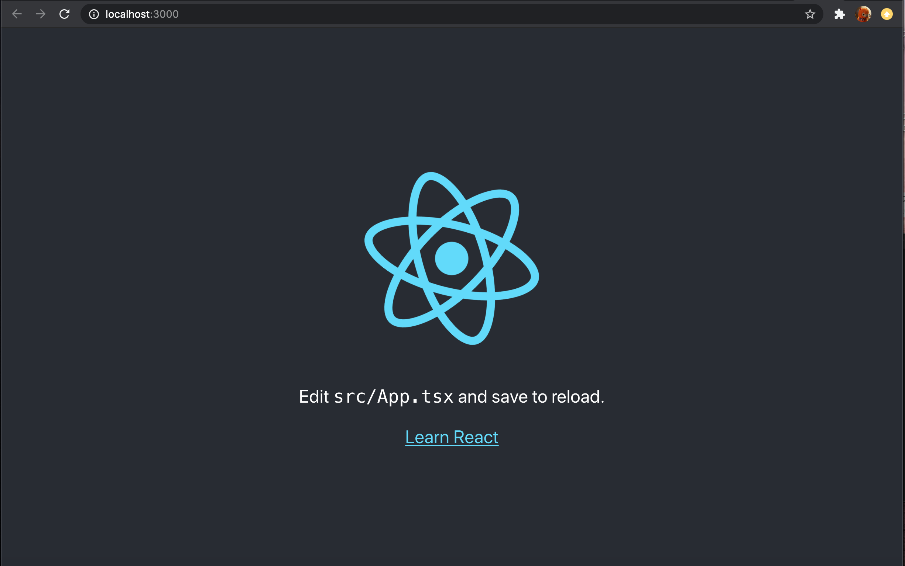
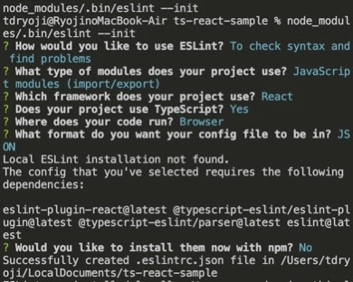
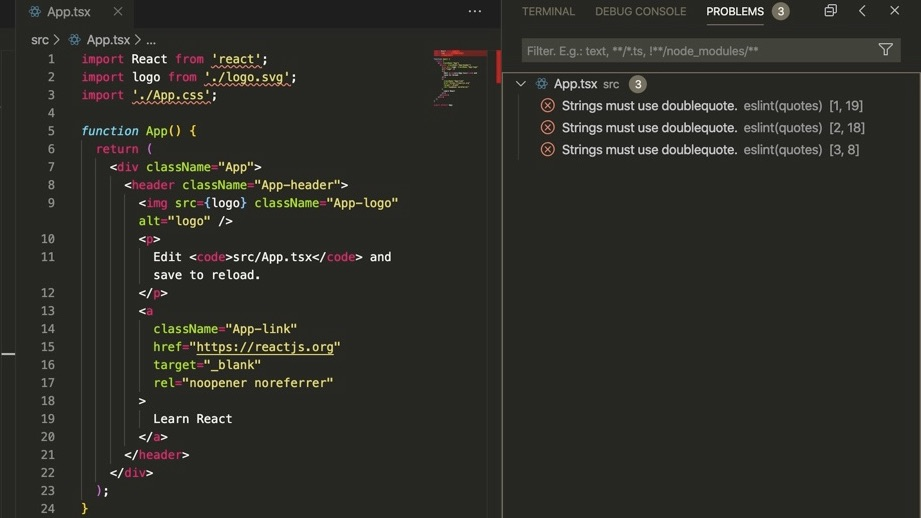
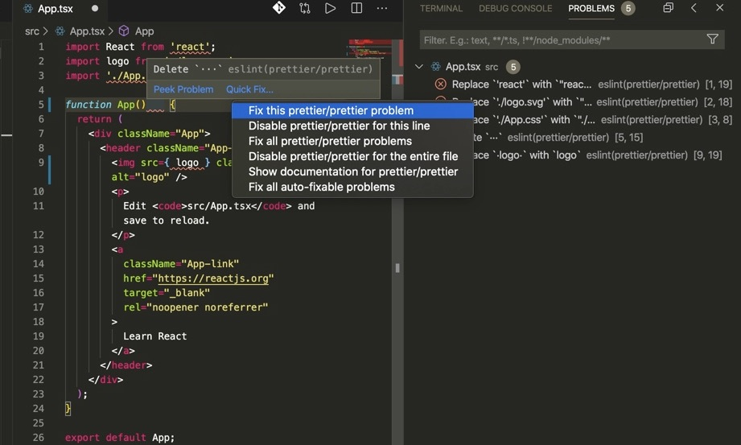

# VSCode + TypeScript で Reactを書くための備忘録

## 始めに

1. JavaScript/TypeScript を書く上で必要になる環境の構築
2. TypeScript で React のプロジェクトを作成する方法
3. TypeScript で React を書くときの基本（まだ）
4. ESLint + Prettier によってコードスタイルを保つための環境の構築（2020/10/19 時点）

についてメモしたものです．特に 4 は複雑で，手順を飲み込んだ上で実際に手元に環境を構築するのにかなり苦労しました．訂正箇所があればコメントお願いします．

## 1. Node.js と yarn を使えるようにする

React などを使って JavaScript/TypeScript で UI の構築を行うためには，まず JavaScript 実行環境である Node.js をインストールする必要がある．使用 PC ごとに下の記事を参考にして Node.js の環境を構築する．

Macの場合：[MacにNode.jsをインストール]( https://qiita.com/kyosuke5_20/items/c5f68fc9d89b84c0df09)

Windowsの場合：[windows10にNode.jsをインストールする](https://qiita.com/Masayuki-M/items/840a997a824e18f576d8)

Node.js をインストールした際にパッケージマネージャーである npm も PC にインストールできているはず（ターミナルに` npm --version` と入力すればバージョンと共に入っていることが確認できる）．最近では npm と互換性があり，高速に動作する yarn というパッケージマネージャーも出てきているため，今回はこちらも合わせて `npm --global install yarn` でインストールする．

参考：[npmとyarnのコマンド早見表](https://qiita.com/rubytomato@github/items/1696530bb9fd59aa28d8)

## 2. TypeScript によるプロジェクト用のフォルダを作る

大規模なプログラムを書く際，生の JavaScript ではなく TypeScript を使うことによって型チェックや（ VSCode による）入力補完といった恩恵を受けられる．結果として，コードの可読性や開発の効率を上げることが可能になる．そのため，ここからは TypeScript で React の開発を行うための方法について紹介する．

例として，カレントディレクトリに ts-react-practice という名前で React のプロジェクトフォルダを作成することを考える．下のように ` --template typescript ` を加えることで TypeScript による React のプロジェクトが作成できる（加えなかった場合は JavaScript によるプロジェクトが作成される）．

```zsh
npx create-react-app ts-react-practice --template typescript
```
成功すればターミナルで次のような表示が出るはず．
```zsh
We suggest that you begin by typing:

  cd ts-react-practice
  yarn start

Happy hacking!
```

画面通りに入力するとブラウザでこのように実行される．


## 3. TypeScript で React のプログラムを書く際の基本

*この章は書きかけです*

## 4. ESLint + Prettier によるコードの作成環境を構築する

日本語で書かれた各種 Web サイトだけでなく公式のドキュメントも参照する方が良い（サイトによって情報が曖昧だったり，そもそも情報の移り変わりが激しいため，かつて取られた方法が非推奨になっているケースがある）．調べた中で参考になると感じた記事を以下に示しておく．

- [ESLint と Prettier の共存設定とその根拠について](https://blog.ojisan.io/eslint-prettier)：

  設定に悩んでいたとき非常に参考になった．

- [VS CodeにPrettier・ESLint・Stylelintを導入してファイル保存時にコードを自動整形させる方法](https://wemo.tech/3307)：

  今回 VSCode での環境構築を行う際に参考にした．

- 公式のドキュメント 
  - [ESLint: Getting Started with ESLint](https://eslint.org/docs/user-guide/getting-started)
  - [Prettier: Install](https://prettier.io/docs/en/install.html)

### ESLint の導入
1. ESLint 本体について

    通常は `yarn add eslint --dev` によってインストールするが，今回は `create-react-app` でプロジェクトを作成した際に ESLint が導入されている． `eslint -v` or `eslint --version` でバージョンが確認できるが，
    ```zsh
    npm ls eslint
    ```
    とするとプロジェクトフォルダ内の `node_modules` に ESLint があることが確認できる．

1. VSCode との連携

    - 拡張機能の追加
    
      VSCode の拡張機能である「 [ESLint](https://marketplace.visualstudio.com/items?itemName=dbaeumer.vscode-eslint) 」を追加する．このプラグインによって， VSCode の「設定」から ESLint に関する設定が使えるようになる．

    - VSCode の「設定」について

      `ESLint: enable` の項目がチェックされていることを確認する．また ESLint の自動修正を保存時に自動で適用するため， `settings.json` の編集から `editor.codeActionsOnSave` を下のように設定する．[^formatOnSave]
      ```json
      "editor.codeActionsOnSave": {
          "source.fixAll.eslint": true
      },
      ```
      [^formatOnSave]: 似た設定で `editor.formatOnSave` というものもあるが，こちらは現在非推奨になっている（引用は VSCode ESLint Extention の `eslint.format.enable` より）．
          > Although you can also use the formatter on save using the setting `editor.formatOnSave` it is recommended to use the `editor.codeActionsOnSave` feature since it allows for better configurability. 

2. ESLint の設定ファイルである `.eslintrc.json` を作成する

    VSCode のコマンドパレットを開き `ESLint: Create ESLint Configuration` を実行し，次のように入力すると `.eslintrc.json` が作成される（ `node_modules/.bin/eslint --init` を実行するのと同じ）．

    

    特に気をつけなければならないのは
    - Which framework does your project use?
      今回は **`React`** を選択する（ `Vue` もある）．
    - Does your project use TypeScript?: **Yes**
    - What format do you want your config file to be in?
    `.js` の形式で設定することもできるが，今回は `.json` の場合を説明する．
    - Would you like to install them now with npm?: **No**

    入力を終えるとプロジェクトフォルダの中に `.eslintrc.json` が作成される．以下のようになっているかを確認する．
    ```javascript
    {
        "env": {
            "browser": true,
            "es6": true
        },
        "extends": [
            "eslint:recommended",
            "plugin:react/recommended",
            "plugin:@typescript-eslint/eslint-recommended"
        ],
        "globals": {
            "Atomics": "readonly",
            "SharedArrayBuffer": "readonly"
        },
        "parser": "@typescript-eslint/parser",
        "parserOptions": {
            "ecmaFeatures": {
                "jsx": true
            },
            "ecmaVersion": 2018,
            "sourceType": "module"
        },
        "plugins": [
            "react",
            "@typescript-eslint"
        ],
        "rules": {
        }
     }
     ```
     試しに `"rules"` の部分を
     ```javascript
     {
         "rules": {
          quotes: ['error', 'double'],
        }
     }
     ```
     として，ダブルクオーテーションでないとエラーが出るように設定してみる．写真のようになれば， ESLint が動いていることが確認できる．
     

### Prettier の導入
1. Prettier をインストールする
    ```zsh
    yarn add --dev --exact prettier
    ```
1. VSCode の拡張機能「 [Prettier - Code formatter](https://marketplace.visualstudio.com/items?itemName=esbenp.prettier-vscode) 」を追加する
2. Prettier の設定ファイルである `.prettirrc` を作成・記述する
   例を示す．
   ```javascript
   {
     "printWidth": 100,
     "trailingComma": "es5"
   }
   ```

### ESLint と Prettier の連携
1. `eslint-plugin-prettier` と`eslint-config-prettier` をインストールする
   ```zsh
   yarn add --dev eslint-plugin-prettier eslint-config-prettier
   ```

1. `eslint-plugin-prettier` の適用
   `.eslintrc.json` の `"extends"` を以下のように書き加える．
   ```javascript
   {
     "extends": [
        "eslint:recommended",
        "plugin:react/recommended",
        "plugin:@typescript-eslint/eslint-recommended",
        // 他の extends の内容に上書きされないよう末尾に plugin の設定を適用
        "plugin:prettier/recommended"
    ],
   }
   ```
   保存したあと， `app.tsx` に適当にスペースを加えてフォーマットを乱すと ESLint のエラーとして写真のように出力される．
   
   赤い波線部をホバーして `Quick Fix` から `fix this prettier/prettier problem` 又は `fix all auto-fixable problem` を選ぶか，保存をすると自動整形される．
    